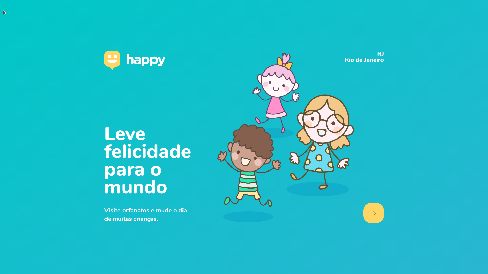

<h1 align="center">
    
</h1>

<h4 align="center"> 
	:construction: NextLevelWeek 3 🚀 :construction:
</h4>

	
  
	
  

  <a href="#-nlw">Next Level Week 3</a>
  <a href="#-project">Projeto</a>
  <a href="#tecnlogies">Tecnologias</a>
  <a href="#-layout">Layout</a>
  <a href="#license">License</a>

## 💻 Projeto

Happy é um projeto para ajudar orfanatos

## :rocket: Tecnologias

Esse projeto foi desenvolvido com as seguintes tecnologias

- [Node.js][nodejs]
- [TypeScript][typescript]
- [React][reactjs]
- [React Native][rn]

## 🔖 Layout

Acesse o layout aqui: [Figma](https://www.figma.com/file/mDEbnoojksG4w8sOxmudh3/Happy-Web/duplicate).

## :information_source: Como usar

Baixe esse repositório e execute os seguintes comando na pasta do projeto:

# Install dependencies
$ yarn install

# Start project
$ yarn start

# Running on port 3000

## :memo: Licença

This project is under the MIT license. See the [LICENSE](https://github.com/ArthurC04/Happy/blob/main/LICENSE) for details.

[nodejs]: https://nodejs.org/
[typescript]: https://www.typescriptlang.org/
[expo]: https://expo.io/
[reactjs]: https://reactjs.org
[rn]: https://facebook.github.io/react-native/
[yarn]: https://yarnpkg.com/
